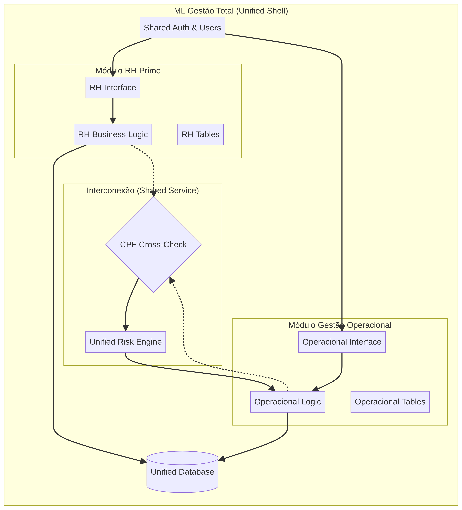

# Entrega Final: Estrutura Modular ML Gestão Total

**Autor:** Equipe ML Gestão Total
**Data:** 20 de fevereiro de 2026

## 1. Visão Geral do Projeto
O projeto **ML Gestão Total** unifica os sistemas **RH Prime** e **Gestão Operacional** em uma arquitetura modular de alta coesão e baixo acoplamento. A solução permite que cada módulo evolua de forma independente, enquanto compartilha uma base de dados e autenticação unificada, utilizando o **CPF** como chave de interconexão para inteligência de riscos.

## 2. Arquitetura Implementada
A nova estrutura de pastas segue os princípios de design modular:

```text
ml-gestao-total/
├── client/src/modules/
│   ├── rh/             # Interface do RH Prime
│   └── operacional/    # Interface da Gestão Operacional
├── server/modules/
│   ├── rh/             # Lógica de negócio do RH Prime
│   └── operacional/    # Lógica de negócio da Gestão Operacional
├── shared/             # Chave CPF e tipos comuns
└── drizzle/            # Esquemas de banco de dados por módulo
```

### Diagrama de Arquitetura
O diagrama abaixo ilustra como os módulos se conectam através da camada de interconexão:



## 3. Protótipo de Interconexão (Validação)
Foi desenvolvido um protótipo funcional em `server/prototype_test.ts` que valida a consulta cruzada via CPF. Os resultados demonstraram a eficácia na identificação de:
*   **Conflitos de Vínculo:** Identifica quando um CLT está sendo alocado indevidamente como diarista.
*   **Histórico de Risco:** Alerta sobre alta frequência de alocações ou riscos trabalhistas.
*   **Status Unificado:** Fornece uma visão consolidada do colaborador em ambos os sistemas.

## 4. Próximos Passos Recomendados
Para a evolução do MVP, sugerimos as seguintes etapas:

1.  **Migração de Dados:** Unificar as tabelas de `users` e `audit_logs` no banco de dados de produção.
2.  **Integração de UI:** Criar o "Shell" principal (Dashboard) que permite navegar entre os módulos sem novos logins.
3.  **Refatoração de Rotas:** Ajustar as rotas tRPC para seguirem o padrão `/api/trpc/rh` e `/api/trpc/operacional`.
4.  **Política de Privacidade:** Implementar uma política unificada em conformidade com a LGPD, abrangendo ambos os contextos de uso dos dados.

## 5. Considerações Legais e de Segurança
*   **LGPD:** O uso do CPF como chave primária é justificado pela necessidade de conformidade trabalhista e fiscal, mas deve ser acompanhado de criptografia (já presente no RH Prime) e consentimento claro.
*   **Riscos Trabalhistas:** O motor de risco do módulo Operacional deve ser validado periodicamente por assessoria jurídica para garantir que os parâmetros de rotatividade atendam às normas vigentes.

---
*Este documento serve como guia técnico para a continuidade do desenvolvimento do ML Gestão Total.*
